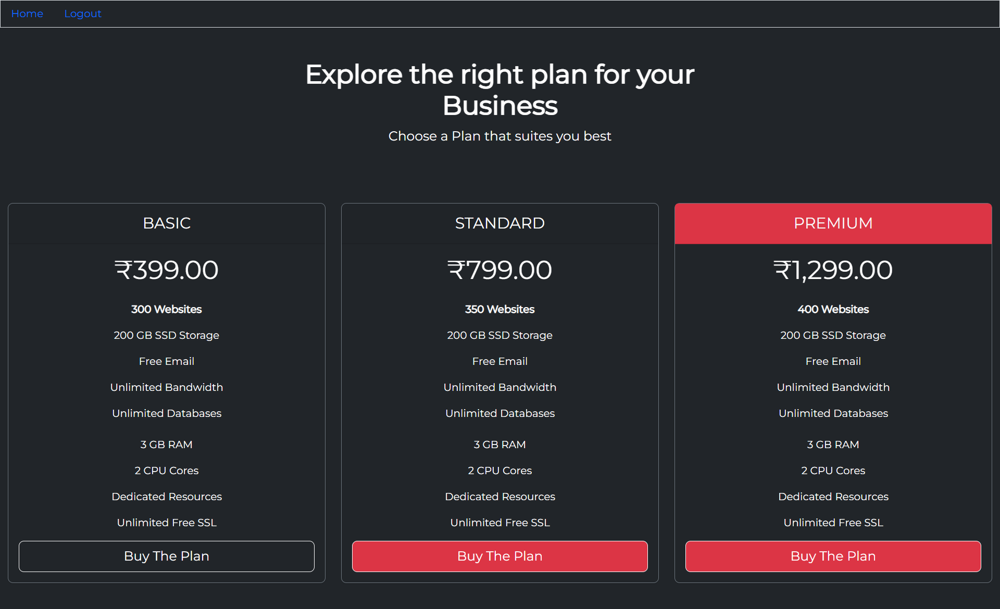

# Shopify Clone (Responsive)


`Author:` Padmanabh Belavadi

This is the Subsription Application where user can see the features of plans and he can buy, there are 3 categories `BASIC`, `STANDARD` and `PREMIUM`. I Made this Website Completely On MERN Stack

## My Project Looks Like :




## How to Install This Project

<hr>

- Clone This Project 
```
git clone https://github.com/Padmanabh-B/Substribtion-App.git
```

- Add Your Database URL in `.env` file


- Go to Client Folder Open Terminal and Run 
```
npm start
```

- Go to Server Folder Open Terminal and Run 
```
npm start
```


<br>

## Reach Me Out on
<hr>

 [Linkedin](https://www.linkedin.com/in/padmanabh-belavadi)


 [GitHub](https://github.com/padmanabh-b)


 [Instagram](https://www.instagram.com/legend_padmanabh/)

 [Findcoder](https://www.findcoder.io/u/padmanabh_b)


